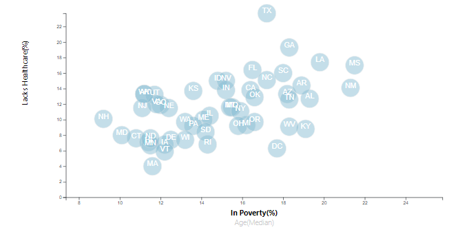

# D3-Challenge - Data Journalism and D3

## Background

The task involved in this activity is to analyze the data for a major metro paper that involves current trends shaping people's lives, as well as creating charts, graphs, and interactive elements to help readers understand the findings.

The editor wants to run a series of feature stories about the health risks facing particular demographics. This involves sifting through information from the U.S. Census Bureau and the Behavioral Risk Factor Surveillance System.

The data set included with the assignment is based on 2014 ACS 1-year estimates from the [US Census Bureau](https://data.census.gov/cedsci/). The current data set includes data on rates of income, obesity, poverty, etc. by state. In this data set, MOE stands for "margin of error."

### D3 Times: 

A scatter plot is created between two of the data variables that is, `Healthcare vs. Poverty`. The `Healthcare vs. Age(median)` demographics is included in the chart and the and the click events is created so that the users can decide which data to display.

Using the D3 techniques, a scatter plot is created that represents each state with circle elements. This graphic is created in the `app.js` file. The data is pulled in from `data.csv` by using the `d3.csv` function.

* The state abbreviations is included in the circles.

* The axes and labels are created and situated to the left and bottom of the chart.

* The d3-tip is incorporated to reveal a specific element's data when the user hovers their cursor over the element.

